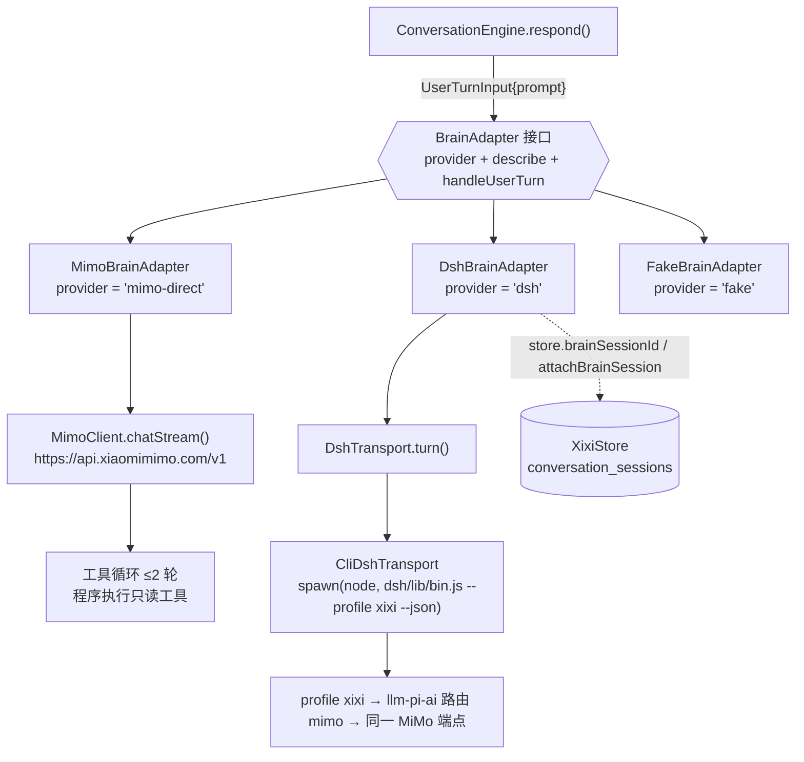
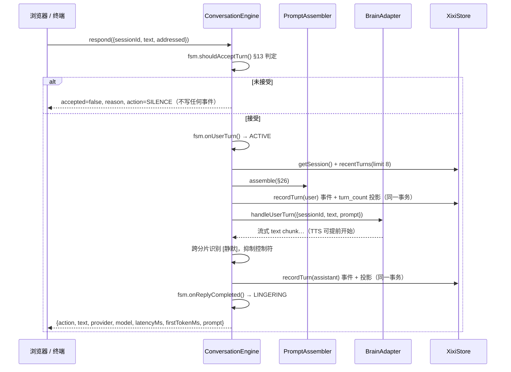

# 架构（当前实现）

> 最后更新：2026-09-30
> 权威来源：`packages/**`、`apps/brain-dsh/**`、`services/voice-edge/**`、`scripts/**`、`tests/**`；`docs/progress.md`（结论与数字）、`docs/recon/*`（外部系统实测）、`docs/adr/0001`~`0008`
> 若与代码不一致，以代码为准，并请立即修正本文件

**一句话**：西西能听（浏览器麦克风 → VAD → ASR）、能判断该不该说话（确定性 FSM）、能说得像家里人（§26 提示词 + 人格指令）、能不说（§55 沉默）、能在重启后还是同一个西西（事件日志 + 人格基线 + Harness 会话映射）。

本文描述的是**现状**。方案原文 [`../xixi_ai_companion_project_plan.md`](../xixi_ai_companion_project_plan.md) 里的 WorldState、Memory、FutureHook、ProactiveEngine、唤醒词、摄像头都**尚未实现**，见 §7。

## 1. 仓库里真实存在的部分

```text
packages/contracts/       事件信封 + 3 类 payload schema + fail-closed 校验器（唯一契约来源）
packages/domain/          唯一写 SQLite 的包：events / 会话投影 / 人格基线 / 迁移执行器 / 配置 / 时钟
packages/conversation/    FSM（§12/§13）+ PromptAssembler（§26）+ ConversationEngine（一轮的编排）
packages/brain-adapter/   BrainAdapter 接口 + MimoBrainAdapter（实时）+ DshBrainAdapter + Fake/Scripted 替身 + 只读工具
packages/model-adapters/  MimoClient（chat/chatStream/transcribe/synthesize/chatJson）+ WeatherClient（Open-Meteo）
apps/brain-dsh/           CliDshTransport（每轮一个 dsh 进程）+ profile patch（MiMo 路由 + 最小插件集）
plugins/xixi-tools/       DSH 侧工具插件（当前只有 xixi_get_current_time）
services/voice-edge/      voice_edge/segment.py（Silero VAD 分段 CLI）+ loopback.py（设备回环）+ config.py
scripts/                  serve-chat.ts（试用页）/ chat.ts / voice-turn.ts / voice-bargein.ts / eval-* / verify-*
tests/                    unit / integration / scenarios（corpus.ts），replay 目录仍为空
```

只有 `packages/brain-adapter` 与 `apps/brain-dsh` 知道 DSH 存在（`packages/brain-adapter/src/index.ts`、`apps/brain-dsh/src/index.ts`）——铁律 9。

## 2. 两个大脑实现，同一个 `BrainAdapter` 接口

接口定义在 [`types.ts`](../packages/brain-adapter/src/types.ts) 的 `BrainAdapter`：`provider`、`describe()`、
`handleUserTurn()`，以及四个**已声明但抛 `NOT_IMPLEMENTED`** 的能力。



两套实现的差别（其余代码看不到这个差别）：

| | `DshBrainAdapter` | `MimoBrainAdapter` |
|---|---|---|
| 源码 | [`dsh.ts`](../packages/brain-adapter/src/dsh.ts) | [`mimo.ts`](../packages/brain-adapter/src/mimo.ts) |
| `provider` | `'dsh'` | `'mimo-direct'` |
| 调用方式 | 每轮 spawn 一个 `dsh` 进程，NDJSON 一次性返回 | 一次 HTTP 流式请求，逐 delta 产出 chunk |
| 会话记忆 | 交给 DSH：`--session-id` + 落库的 `brain_session_id` | 自己组装 messages：`system` + history + `user`（`#messages()`） |
| 流式 | 无（整段回复一次性 `splitIntoChunks` 回放） | 有（`chatStream`，首字 0.3~1.2s，`docs/adr/0008`） |
| 工具 | DSH 插件注册表（`plugins/xixi-tools/index.js`） | 适配器内循环（`#executeTool`，≤2 轮，只读） |
| 实测每轮 | **4~7 秒**（`docs/adr/0008-realtime-path-direct-mimo.md`） | 首字 0.3~1.2s；总时长 P50 2.5s / P95 5.1s（`docs/progress.md` §0） |
| 提示词 | DSH 自带 agent 框架提示词 + profile patch 的 persona | 完全由 `PromptAssembler` 掌握 |
| 用在 | `npm run verify:m0` / `verify:provider` / `--dsh` 开关 | `npm run chat`、`npm run web`、`voice:turn`（默认） |

**为什么实时走直连**（[ADR-0008](adr/0008-realtime-path-direct-mimo.md)）：方案 §33 要求「用户语音结束到开始回应 P50 < 2.5s」，
而每轮启动 harness profile 的 4~7 秒无法达标；直连后提示词输入 token 从 3515（DSH 的编码 Agent 提示词）降到 307——
后者不只是省钱，而是**人设正确性**（陪伴角色不能被框架话术带跑）。DSH 没有被删除：它留在 M0 已验收的 Harness 路径，
以及将来需要会话 / 工具 / 子代理机制的元智能体（Observer、MemoryExtractor、Reflection）。

代价：直连路径必须自己负责会话历史、工具轮数上限、结构化输出健壮性（`MimoClient.chatJson` 的本地校验 + 回退，
见 `docs/progress.md` §2.11）。

## 3. 一次文本对话回合的完整数据流

文本入口有两个：试用页 `POST /api/turn`（`scripts/serve-chat.ts`）与终端 `npm run chat`（`scripts/chat.ts`）。



要点（每条都对应代码）：

- **判定先于模型**：`IDLE` 时未直呼直接拒绝，连事件都不写；这是「电视里的声音不进对话历史」的机制
  （`tests/integration/conversation-engine.test.ts` 断言 `store.eventCount() === 0`）。
- **`prompt` 是唯一喂给模型的上下文来源**：`ConversationEngine.buildPrompt()` 组装的
  `{system, history, user}` 直接作为 `UserTurnInput.prompt` 传下去；`System`=稳定前缀，`user`=变化后缀。
  适配器不接收 `context`（`BrainContext.worldState` 因此仍然闲置，属 M1+）。
- **事件落库在适配器两侧各一次**：用户轮次在调用模型**之前**写（`recordTurn(user, SPEAK)`），
  助手轮次在拿到结果后写（`action` 可能已被引擎改写为 `SILENCE`）。
- **§55 沉默在引擎层兜底**：无论适配器报 `SPEAK` 还是 `SILENCE`，只要整句是 `[静默]` 就转成 `SILENCE`
  并把 `text` / `toolName` 落为 `null`（`packages/conversation/src/engine.ts`）。
- **事件里不存延迟与提示词**：`conversation.turn` payload 只有
  `session_id / turn_index / role / action / text / tool_name`；`latencyMs`、`firstTokenMs`、`prompt`
  只随本次返回值交给调用方（试用页把它们显示在气泡下方）。
- **健康事件只在安静模式与进程收尾时写**：`ConversationEngine.quiet()` 与各脚本收尾调用 `recordHealth`；
  普通轮次不写 `system.health`。
- **Latency 分布**：`docs/progress.md` §0 记录 P50 2.5s / P95 5.1s（总时长），首字 P50 1.2s / P95 2.9s。

## 4. 一次语音回合的完整数据流

```mermaid
flowchart LR
  MIC["浏览器 getUserMedia<br/>echoCancellation + noiseSuppression"] --> WAV["AudioContext 采集 → 16-bit PCM WAV<br/>（serve-chat.ts 内联的 encodeWav/base64）"]
  WAV --> API["POST /api/voice"]
  API --> W1["写 data/voice-web/capture-*.wav"]
  W1 --> VAD["python -m voice_edge.segment<br/>Silero VAD（ADR-0007 基线）"]
  VAD -->|"segments[0]"| SL["sliceWav 只取语音段<br/>data/voice-web/speech-*.wav（§20.1 只上传语音段）"]
  SL --> ASR["MimoClient.transcribe()<br/>mimo-v2.5-asr"]
  ASR --> ENG["同一个 ConversationEngine.respond()"]
  ENG --> TTS["MimoClient.synthesize()<br/>mimo-v2.5-tts"]
  TTS --> PLAY["new Audio('data:audio/wav;base64,…').play()"]
```



- VAD 基线来自 [ADR-0007](adr/0007-voice-stack-pipecat.md) 的实测：`confidence=0.7`、`start_secs=0.2`、
  **`stop_secs=0.6`**（默认 0.2 会在中文句子里的 352ms 逗号停顿处提前 1440ms 判定说完）、**`min_volume=0.0`**
  （默认 0.6 会多花 320~480ms 才开始判语音）。参数在 [`config.py`](../services/voice-edge/voice_edge/config.py)。
- 「没有语音」是一个**结果**而不是崩溃：`segment.py` 以退出码 2 表示 `segments: []`，
  Node 侧把 `0` 与 `2` 都当成功，页面返回 `reason: 'NO_SPEECH_DETECTED'` 并提示音量/设备问题，
  不会假装听懂（`scripts/serve-chat.ts` 的 `runVad` / `handleVoice`）。
- **浏览器采集是必要的，不是偏好**：Python `sounddevice` 路径在本机拿不到语音
  （录音 99.5% 能量在 100Hz 以下，见 [`recon/device-acceptance-2026-09-30.md`](recon/device-acceptance-2026-09-30.md)）。
- **一次性进程而非常驻服务**：每次 VAD 都要付一次 Python 冷启动（`segment.py` 特意把 `loadMs` 与 `processMs`
  分开输出，只有后者算实时延迟）。常驻语音服务属下一步。
- 打断（§14.2）目前是**离线测量**：`scripts/voice-bargein.ts` 用夹具模拟「西西正在说话时用户开口」，
  判定延迟 **192ms**，把播放截断点写成 WAV 作为可审计证据。**扬声器真正静音的延迟未验收**（§33 的 P50 < 500ms）。

## 5. 持久化：SQLite 里的四张表

唯一写库的包是 `packages/domain`（`node:sqlite`，`PRAGMA journal_mode=WAL`、`foreign_keys=ON`、`busy_timeout=5000`）。
迁移文件是 [`001_initial.sql`](../packages/domain/src/migrations/001_initial.sql)，字段级说明见 [`design/domain-model.md`](design/domain-model.md)。

| 表 | 角色 | 关键列 |
|---|---|---|
| `events` | **唯一事实来源**；对话轮次就是事件 | `sequence` 自增主键、`event_id UNIQUE`、`event_type`、`schema_version`、`timestamp`、`source`、`room`、`actor`、`confidence`、`correlation_id`、`session_id`、`payload_json`；索引 `idx_events_type_sequence` / `idx_events_session` / `idx_events_correlation` |
| `conversation_sessions` | **可重建的投影**（不是事实来源） | `session_id` PK、`started_at`、`last_activity_at`、`ended_at`、`turn_count`、`brain_provider`、`brain_session_id`；索引 `idx_sessions_brain (brain_provider, brain_session_id)` |
| `self_profile` | 有效人格基线（21 个属性，§7.2） | `property` PK、`schema_version`、`value`、`source`、`updated_at` |
| `self_profile_history` | 人格变更历史（§7.5） | `change_id` PK、`before_value`、`after_value`、`source_type`、`source_event_id`、`summary`、`confidence`、`created_at` |

**「对话轮次即事件、没有 `conversation_turns` 表」的取舍**（[ADR-0003](adr/0003-raw-events-vs-memory.md)）：
建轮次表意味着同一事实两份真相——纠正、重放、迁移都要双份维护。因此：

- 一轮 = 一条 `conversation.turn` 事件；「最近 N 轮」用
  `SELECT … WHERE event_type='conversation.turn' AND session_id=? ORDER BY sequence DESC LIMIT ?` 再 `reverse()` 得到；
- `session_id` 列由 `appendEvent` 从 payload 的 `session_id` 提取（`sessionIdOf`）以便建索引，不重复存事实；
- `recordTurn` 把「追加事件」与「更新投影（`turn_count`、`last_activity_at`）」放在**同一个事务**里
  （`BEGIN IMMEDIATE` / `COMMIT` / `ROLLBACK`），投影不可能与日志不一致；
- 代价是「第 N 轮」变成查询成本，并且**没有外键**保证投影一致性：将来若有第二条写路径，必须同样进入该事务。

另外两条不变量：

- `seedSelfProfile` 只补缺（`ON CONFLICT(property) DO NOTHING`），重启是**恢复**而不是重置；
  `overrideSelfProfile` 是管理员覆盖（写 history），**模型驱动的人格学习（M3）尚未实现**。
- 已发布迁移被改写就拒绝启动：`migrate()` 记录每个文件的 sha256，内容变动抛 `MIGRATION_CHECKSUM_MISMATCH`（§47.3、铁律 10）。

`XixiStore.resume()` 是恢复入口：`latestSession()` + `recentTurns(…, 8)` + `selfProfile()`。

## 6. 进程、端口与调用关系

| 进程 / 入口 | 触发方式 | 说明 |
|---|---|---|
| 试用页 HTTP 服务 | `npm run web`（`scripts/serve-chat.ts`） | 监听 **`127.0.0.1:8791`**（`--port` 或 `XIXI_WEB_PORT` 可改）；提供 `/`、`/api/state`、`/api/turn`、`/api/voice`、`/api/quiet`、`/api/session` |
| 终端对话 | `npm run chat [-- --fake/--dsh]` | 同进程内直接调用 `ConversationEngine`，无 HTTP |
| DSH 子进程 | 默认**不启动**；仅 `--dsh` 或 `verify:*` 时 | `CliDshTransport` 用 `spawn(process.execPath, [dsh/lib/bin.js, --profile, xixi, --json, …])`，`cwd = REPO_ROOT`、`DSH_HOME = <repo>/.dsh`；每轮一个进程，进程间不常驻 |
| Python VAD | 每次语音回合 | `spawn(<repo>/.venvs/voice-pipecat/Scripts/python.exe, ['-m','voice_edge.segment', wav])`，`cwd = services/voice-edge`（因此该目录必须在 cwd 才能 import `voice_edge`）；见 `scripts/serve-chat.ts`、`scripts/voice-turn.ts` |
| SQLite | 进程内 | 试用页 `data/web-chat/xixi.sqlite`、终端 `data/chat/xixi.sqlite`、语音脚本 `data/voice/xixi.sqlite`（`openXixiStore({dataDir})`） |

即：**浏览器（页面 + 麦克风）→ Node 试用页进程 → （可选）DSH 子进程 / MiMo HTTP / Python VAD 子进程**。
没有任何常驻 broker，也没有 `EventBus` 抽象：写入方在进程内直接调用领域层（[ADR-0004](adr/0004-in-process-event-bus-for-poc.md)）。

## 7. 明确**未实现**的部分，以及将来插在哪里

| 未实现 | 现状证据 | 将来插在哪 |
|---|---|---|
| **WorldState**（当前世界投影） | 无表、无代码；`BrainContext.worldState` 字段已声明但引擎从不传 `context`，因此始终为空 | M6 摄像头 presence 第一次产生；`presence.changed` schema 已存在并在测试中使用 |
| **Memory**（提取 / 检索 / 纠正） | 无表、无代码；`extractMemories` / `reflect` 调用即抛 `BrainError('NOT_IMPLEMENTED', milestone: 'M4')` | M4：新增 `002_*.sql`，保留 `sourceEventIds` 指回 `events`；`MemoryCandidate` 形状已固定 |
| **FutureHook** | 无表、无代码；只存在于 `MemoryCandidate.type` 与 `ReflectionResult.futureHooks` 的类型里 | M4/M5，与 Memory 同一批迁移 |
| **ProactiveEngine**（候选 / 硬门禁 / 社交预算） | 无代码；`evaluateProactiveCandidate` 抛 `NOT_IMPLEMENTED(M5)` | M5（§15）：确定性硬门禁 + `proactive_decisions` 表（§22.1 Decision Trace，只存 `reason_code` 与分数） |
| **唤醒词 / 搭话判定（§13 完整版）** | 无代码；`config/xixi.example.yaml` 的 `features.wake_word: false`，试用页用「发送 / 按住🎤」按钮当作直呼 | M2：ADR-0007 已实测两个语音框架**都无法区分电视与真人**，必须自己做（唤醒词 + 说话人相似度 + 会话状态 + 语义承接融合） |
| **摄像头 presence** | 无代码；`features.camera_presence: false` | M6：perception-edge 发 `presence.changed` |
| **模型驱动的人格学习（§7.4）** | 只有管理员 `overrideSelfProfile`；`interpretFeedback` 抛 `NOT_IMPLEMENTED(M3)` | M3：Feedback Interpreter（结构化输出 + 受控增量 + history + 回滚） |
| **事件回放（§22.3）** | `tests/replay/` 目录为空 | M5；因为轮次就是事件，不需要先做数据搬迁 |
| **常驻语音服务** | 每次 VAD 都新建 Python 进程 | 下一步：把一次性 CLI 换成常驻进程，去掉冷启动 |
| **`tsc --noEmit` 类型检查** | 无 `tsconfig.json`，类型错误只在运行时暴露 | M1 之前（[ADR-0006](adr/0006-runtime-and-dependency-choices.md)） |

四个未实现能力的**签名已经固定**，调用时抛带 `milestone` 的类型化错误——诚实的缺口，不是静默的桩函数。

## 维护规则

统一规则见 [`design/README.md`](design/README.md#维护规则)。改本文件时对照：

| 改动 | 必须同步的本文件小节 |
|---|---|
| 新增/替换 `BrainAdapter` 实现，或改 `packages/brain-adapter/src/types.ts` | §2（含实现对照表） |
| 改 `packages/conversation/src/engine.ts` 的一轮编排、或事件落库时机 | §3 |
| 改 `services/voice-edge/**`、VAD 基线、`scripts/*voice*`、试用页语音端点 | §4、§6 |
| 改 `packages/domain/src/migrations/*.sql` 或表职责 | §5（并同步 [`design/domain-model.md`](design/domain-model.md)） |
| 改 `scripts/serve-chat.ts` 的端口/端点、新增子进程或常驻服务 | §6 |
| 任何里程碑推进（M2~M6）或新增未实现能力 | §7（做完的从表里移走，新增的写进去） |
| 新增事件类型或迁移 | §5 与 [`event-contracts.md`](event-contracts.md) |
