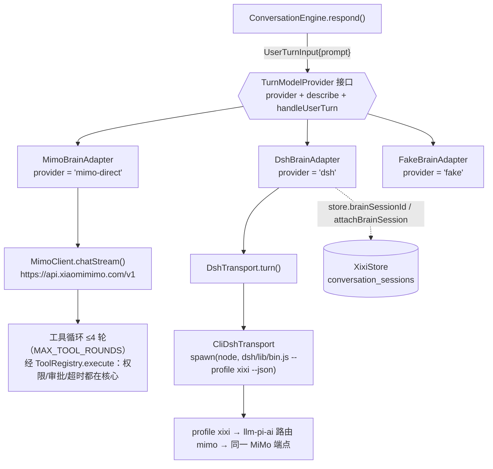
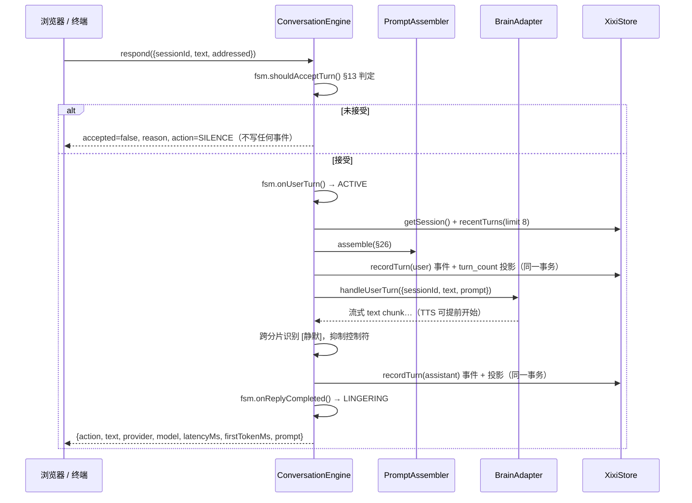
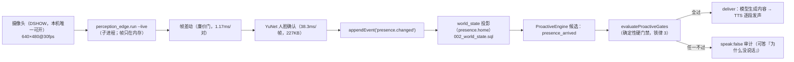

# 架构（当前实现）

> 最后更新：2026-10-04（V0.3 P2 收口：插件内核与 MCP 适配器、工具审批、真实 News、durable Reminder、Provider 三接口拆分；
> 本节新增 §6.2 把「内核已交付」与「入口未接线」分开写）
> 权威来源：`packages/**`、`apps/brain-dsh/**`、`services/{voice-edge,perception-edge}/**`、`scripts/**`、`tests/**`；`docs/progress.md`（结论与数字）、`docs/progress-v03.md`（各 Phase 的交付与遗留）、`docs/recon/*`（外部系统实测）、`docs/adr/*`（**不写死区间**：以 `ls docs/adr` 的实际内容为准）
> 若与代码不一致，以代码为准，并请立即修正本文件

**一句话**：西西能听（浏览器麦克风 → 抗噪前端 → VAD → ASR）、能判断该不该说话（确定性 FSM）、能说得像家里人（§26 提示词 + 人格指令）、能不说（§55 沉默）、能在重启后还是同一个西西（事件日志 + 人格基线 + Harness 会话映射），并且**能自己看到有人在不在**（M6 摄像头在场 → `presence.changed` → WorldState 投影）与**自己找话说**（M5-lite 主动循环，全部先过确定性硬门禁）。

本文描述的是**现状**。方案原文 [`../xixi_ai_companion_project_plan.md`](../xixi_ai_companion_project_plan.md) 里的
**Memory 与 FutureHook 已由 pack Phase 3/4 落地**（未完话题 = `open_threads`；长期记忆 = `episodic_memory` / `semantic_memory` /
`relationship_notes`；计划类钩子以 `open_threads` 实现）；**唤醒词仍未实现**；WorldState 只落了 `presence.home` 一个键。
主动候选的模型侧生成（`evaluateProactiveCandidate`）自 V0.3 P2-F 起**已从适配器接口与三个实现里移除**
（不是留着抛异常）——主动候选由确定性路径产出（`ProactiveEngine` + `evaluateProactiveGates`），
模型只负责读空气；接口现在只有三个（见 §2 与 [ADR-0020](adr/0020-provider-three-interfaces-and-mcp-deps.md)）。见 §7。

## 1. 仓库里真实存在的部分

```text
packages/contracts/       事件信封 + 6 类 payload schema + fail-closed 校验器（唯一契约来源）
packages/domain/          唯一写 SQLite 的包：events / 会话投影 / 人格基线与学习 / 未完话题 / 记忆与状态机（迁移 006）/ WorldState / 迁移执行器 / 配置 / 时钟
packages/conversation/    FSM（§12/§13）+ PromptAssembler（§26）+ ConversationEngine（一轮的编排）+ 主动引擎（ADR-0009/0011）
packages/context/        上下文装配（V0.3 P1）：ContextBuilder（buildUserTurn / buildProactive）、MemoryRetriever（确定性混合排序 + 两道出口闸门）、MemoryCorrectionResolver（纠正闭环）、关系上下文
packages/plugins/          插件内核（V0.3 P2-A）：manifest 校验 + CapabilityRegistry 五能力 + PluginManager 九步生命周期 + 四条「插件不能做」；子路径 ./mcp 是 MCP 客户端适配器（唯一需要 MCP SDK 的地方），./news 是真实 News 插件
packages/runtime/         生产运行时（V0.3 P0-A）：工具链（tool-runtime，含 buildPluginRuntime 装配点）、工具审批宿主（tool-approval）、durable 提醒（reminder-runtime）、常驻考虑循环与候选构造器（proactive-runtime）、语音共享缝（voice-runtime）、感知入库（perception-ingest）、replay 驱动（replay-runtime）
packages/brain-adapter/   TurnModelProvider 接口（+ MultimodalTurnProvider / StructuredInferenceProvider 两个可选面）+ MimoBrainAdapter（实时）+ DshBrainAdapter + Fake/Scripted 替身 + 工具注册表与只读工具
packages/model-adapters/  MimoClient（chat/chatStream/transcribe/synthesize/chatJson）+ WeatherClient（Open-Meteo）
apps/brain-dsh/           CliDshTransport（每轮一个 dsh 进程）+ profile patch（MiMo 路由 + 最小插件集）
plugins/xixi-tools/       DSH 侧工具插件（当前只有 xixi_get_current_time）
services/voice-edge/      voice_edge/{segment,frontend,calibrate,make_noise_fixtures,loopback}.py（VAD 分段 + 抗噪前端 + 噪声底校准 + 噪声夹具 + 设备回环）
services/perception-edge/ perception_edge/{run,bench}.py（抓帧 + 帧差动 + YuNet 人脸 → presence 事件；M6；**检测结果经 stdout 交给 Node 侧单写者入库**，子进程不再拿 `--db`）
scripts/                  serve-chat.ts（试用页）/ chat.ts / voice-turn.ts / voice-bargein.ts / field-test.ts（现场测试控制台）
                          / verify-*.ts（provider、m0、structured-output、camera-presence、voice-noise）/ eval-* / make-audio-fixtures.ts
tests/                    unit（含 core/、voice/、context/）/ integration / console / perception / scenarios / **replay（V0.3 P0-D：JSON 脚本 + 注入 Clock 的行为回放）**
```

只有 `packages/brain-adapter` 与 `apps/brain-dsh` 知道 DSH 存在（`packages/brain-adapter/src/index.ts`、`apps/brain-dsh/src/index.ts`）——铁律 9。

## 2. 三个大脑实现，同一个 `TurnModelProvider` 接口

接口定义在 [`types.ts`](../packages/brain-adapter/src/types.ts)：**必须**实现的只有 `TurnModelProvider`
（`provider`、`describe()`、`handleUserTurn()`）；另有两个**可选**面——`MultimodalTurnProvider`
（在 `TurnModelProvider` 之上加字面量 `supportsImages: true`，真能收图的适配器才声明）与
`StructuredInferenceProvider`（`inferJson()`）。V0.3 P2-F 之前那个七成员的 `BrainAdapter` 已经拆掉：
四个能力（`evaluateProactiveCandidate` / `interpretFeedback` / `extractMemories` / `reflect`）
从接口与三个实现里一并**删除**，类型留作 retired capability 数据契约并注明真实归属在 `@xixi/conversation`
（[ADR-0020](adr/0020-provider-three-interfaces-and-mcp-deps.md)）。



两套实现的差别（其余代码看不到这个差别）：

| | `DshBrainAdapter` | `MimoBrainAdapter` |
|---|---|---|
| 源码 | [`dsh.ts`](../packages/brain-adapter/src/dsh.ts) | [`mimo.ts`](../packages/brain-adapter/src/mimo.ts) |
| `provider` | `'dsh'` | `'mimo-direct'` |
| 调用方式 | 每轮 spawn 一个 `dsh` 进程，NDJSON 一次性返回 | 一次 HTTP 流式请求，逐 delta 产出 chunk |
| 会话记忆 | 交给 DSH：`--session-id` + 落库的 `brain_session_id` | 自己组装 messages：`system` + history + `user`（`#messages()`） |
| 流式 | 无（整段回复一次性 `splitIntoChunks` 回放） | 有（`chatStream`，首字 0.3~1.2s，`docs/adr/0008`） |
| 工具 | DSH 插件注册表（`plugins/xixi-tools/index.js`） | 适配器内循环（`#executeTool`，≤4 轮），执行落在 `ToolRegistry.execute`：**权限、审批闸门与超时都不在模型手里** |
| 实测每轮 | **4~7 秒**（`docs/adr/0008-realtime-path-direct-mimo.md`） | 首字 0.3~1.2s；总时长 P50 2.5s / P95 5.1s（`docs/progress.md` §0） |
| 提示词 | DSH 自带 agent 框架提示词 + profile patch 的 persona | 完全由 `PromptAssembler` 掌握 |
| 用在 | `npm run verify:m0` / `verify:provider` / `--dsh` 开关 | `npm run chat`、`npm run web`、`voice:turn`（默认） |

**为什么实时走直连**（[ADR-0008](adr/0008-realtime-path-direct-mimo.md)）：方案 §33 要求「用户语音结束到开始回应 P50 < 2.5s」，
而每轮启动 harness profile 的 4~7 秒无法达标；直连后提示词输入 token 从 3515（DSH 的编码 Agent 提示词）降到 307——
后者不只是省钱，而是**人设正确性**（陪伴角色不能被框架话术带跑）。DSH 没有被删除：它留在 M0 已验收的 Harness 路径，
以及将来需要会话 / 工具 / 子代理机制的元智能体（Observer、MemoryExtractor、Reflection）。

代价：直连路径必须自己负责会话历史、工具轮数上限、结构化输出健壮性（`MimoClient.chatJson` 的本地校验 + 回退，
见 `docs/progress.md` §2.11）。

## 3. 一次文本对话回合的完整数据流

文本入口有两个：试用页 `POST /api/turn`（`scripts/serve-chat.ts`）与终端 `npm run chat`（`scripts/chat.ts`）。



要点（每条都对应代码）：

- **判定先于模型**：`IDLE` 时未直呼直接拒绝，连事件都不写；这是「电视里的声音不进对话历史」的机制
  （`tests/integration/conversation-engine.test.ts` 断言 `store.eventCount() === 0`）。
- **`prompt` 是唯一喂给模型的上下文来源**：`ConversationEngine.buildPrompt()` 组装的
  `{system, history, user}` 直接作为 `UserTurnInput.prompt` 传下去；`System`=稳定前缀，`user`=变化后缀。
  适配器不接收 `context`（`BrainContext.worldState` 因此仍然闲置，属 M1+）。
- **事件落库在适配器两侧各一次**：用户轮次在调用模型**之前**写（`recordTurn(user, SPEAK)`），
  助手轮次在拿到结果后写（`action` 可能已被引擎改写为 `SILENCE`）。
- **§55 沉默在引擎层兜底**：无论适配器报 `SPEAK` 还是 `SILENCE`，只要整句是 `[静默]` 就转成 `SILENCE`
  并把 `text` / `toolName` 落为 `null`（`packages/conversation/src/engine.ts`）。
- **事件里不存延迟与提示词**：`conversation.turn` payload 只有
  `session_id / turn_index / role / action / text / tool_name`；`latencyMs`、`firstTokenMs`、`prompt`
  只随本次返回值交给调用方（试用页把它们显示在气泡下方）。
- **健康事件只在安静模式与进程收尾时写**：`ConversationEngine.quiet()` 与各脚本收尾调用 `recordHealth`；
  普通轮次不写 `system.health`。
- **Latency 分布**：`docs/progress.md` §0 记录 P50 2.5s / P95 5.1s（总时长），首字 P50 1.2s / P95 2.9s。

## 4. 一次语音回合的完整数据流

```mermaid
flowchart LR
  MIC["浏览器 getUserMedia<br/>echoCancellation + noiseSuppression"] --> WAV["AudioContext 采集 → 16-bit PCM WAV<br/>（serve-chat.ts 内联的 encodeWav/base64）"]
  WAV --> API["POST /api/voice"]
  API --> W1["写 data/voice-web/capture-*.wav"]
  W1 --> VAD["python -m voice_edge.segment<br/>Silero VAD（ADR-0007 基线）"]
  VAD -->|"segments[0]"| SL["sliceWav 只取语音段<br/>data/voice-web/speech-*.wav（§20.1 只上传语音段）"]
  SL --> ASR["MimoClient.transcribe()<br/>mimo-v2.5-asr"]
  ASR --> ENG["同一个 ConversationEngine.respond()"]
  ENG --> TTS["MimoClient.synthesize()<br/>mimo-v2.5-tts"]
  TTS --> PLAY["new Audio('data:audio/wav;base64,…').play()"]
```



- VAD 基线来自 [ADR-0007](adr/0007-voice-stack-pipecat.md) 的实测：`confidence=0.7`、`start_secs=0.2`、
  **`stop_secs=0.6`**（默认 0.2 会在中文句子里的 352ms 逗号停顿处提前 1440ms 判定说完）、**`min_volume=0.0`**
  （默认 0.6 会多花 320~480ms 才开始判语音）。参数在 [`config.py`](../services/voice-edge/voice_edge/config.py)。
- **VAD 之前还有一段抗噪前端**（`services/voice-edge/voice_edge/frontend.py`：去直流 + 零相位 120 Hz 双二阶高通 +
  噪声底自适应门限；谱减法可选、**默认关**）。它拿掉的噪声功率的大头（宽带 RMS −5.33 dB），但实测**对 Silero 的
  分段判定几乎无影响**——别把「降噪」读成「VAD 会变好」。实测边界与三条负结论见 [`design/voice.md`](design/voice.md) §1.1 与 `progress.md` §2.13。
- 「没有语音」是一个**结果**而不是崩溃：`segment.py` 以退出码 2 表示 `segments: []`，
  Node 侧把 `0` 与 `2` 都当成功，页面返回 `reason: 'NO_SPEECH_DETECTED'` 并提示音量/设备问题，
  不会假装听懂（`scripts/serve-chat.ts` 的 `runVad` / `handleVoice`）。
- **浏览器采集是必要的，不是偏好**：Python `sounddevice` 路径在本机拿不到语音
  （录音 99.5% 能量在 100Hz 以下，见 [`recon/device-acceptance-2026-09-30.md`](recon/device-acceptance-2026-09-30.md)）。
- **一次性进程而非常驻服务**：生产入口每次 VAD 都要付一次 Python 冷启动（`segment.py` 特意把 `loadMs` 与 `processMs`
  分开输出，只有后者算实时延迟）。**例外**：`scripts/verify-voice-noise.ts` 的 runner 有常驻 Python worker
  （回退开关 `XIXI_VAD_ONESHOT=1` / `--no-vad-worker`），生产入口尚未接。
- 打断（§14.2）目前是**离线测量**：`scripts/voice-bargein.ts` 用夹具模拟「西西正在说话时用户开口」，
  判定延迟 **192ms**，把播放截断点写成 WAV 作为可审计证据。**扬声器真正静音的延迟未验收**（§33 的 P50 < 500ms）。

## 4b. 摄像头在场检测（M6）与主动开口（M5-lite）



- **一键启用**：现场测试控制台（`scripts/field-test.ts`）的 `POST /api/field/live {action:'start'}` = 迁移在场库 →
  起 `perception_edge.run --live` 子进程 → `ProactiveLoop.start()`（先 tick 一次）；`stop` = 停循环 + 关 stdin + SIGTERM。
  真机实测（t78/t80）：`child.pid` 可见、5 秒后 frames 104、`presence` 事件 2 条、`present=true`、`confidence=0.75`；
  停用后子进程真的退出（Windows 上被杀的子进程报 exit 1，脚本按 `AGENTS.md` §3 当正常停止）。
- **隐私**：帧只在内存（子进程 `cv2.imencode` → stdout base64，控制台只留最新一帧，页面用 data URL 显示），
  **不留图像**；`--live` 仍会往 `data/perception/` 写 `presence` 事件库（「不留图像」≠「不写库」）。
  可重跑核对：`node scripts/verify-camera-presence.ts --live --seconds 8`（自报磁盘图像文件 0 个）。
- **门禁没有被放宽**：循环只提供候选与 `candidate_id`，判定全部走同一条 `ProactiveEngine.consider`
  （核对：`git grep -n "\.consider(" -- scripts packages`）；连续 5 次 tick 里只有 1 条放行（其余被 `QUOTA_DAY_EXCEEDED` 拦）。
- **M5-lite 的边界**（诚实清单）：候选只来自**事实**（在场、会话悬置、固定时间钩子、话题池、随机闲聊）、
  **未完话题**（`open_threads`，pack Phase 3：父亲自己说过、还没办完的那件事）与**到点的提醒**
  （V0.3 P2-E 起，`ReminderScheduler.candidateInputs()`）；`routine_expected` 目前没有事实源。
  模型侧候选生成（`evaluateProactiveCandidate`）**不是待补的洞**：它已随 P2-F 从适配器接口移除，
  真实归属是 `ProactiveEngine` / `evaluateProactiveGates`（[ADR-0020](adr/0020-provider-three-interfaces-and-mcp-deps.md)）。
  人格强度默认 `proactivity: 0.85`（阈值 `0.45 + 0.30 × (1 − 0.85) = 0.495`），控制台可调、也可一键关闭循环。

## 5. 持久化：SQLite 里的表

唯一写库的包是 `packages/domain`（`node:sqlite`，`PRAGMA journal_mode=WAL`、`foreign_keys=ON`、`busy_timeout=5000`）。
迁移文件是 [`001_initial.sql`](../packages/domain/src/migrations/001_initial.sql)、
[`002_world_state.sql`](../packages/domain/src/migrations/002_world_state.sql)、
[`003_open_threads.sql`](../packages/domain/src/migrations/003_open_threads.sql)、
[`004_memory.sql`](../packages/domain/src/migrations/004_memory.sql)、
[`005_mood.sql`](../packages/domain/src/migrations/005_mood.sql)（有界的心情，第五轮）、
[`006_memory_status.sql`](../packages/domain/src/migrations/006_memory_status.sql)（P1 记忆状态机）、
[`007_tool_approvals.sql`](../packages/domain/src/migrations/007_tool_approvals.sql)（P2-B 待批工具调用）与
[`008_reminders.sql`](../packages/domain/src/migrations/008_reminders.sql)（P2-E durable 提醒），
字段级说明见 [`design/domain-model.md`](design/domain-model.md)（**迁移只新增、不改写已发布的那几份**，铁律 10）。

| 表 | 角色 | 关键列 |
|---|---|---|
| `events` | **唯一事实来源**；对话轮次就是事件 | `sequence` 自增主键、`event_id UNIQUE`、`event_type`、`schema_version`、`timestamp`、`source`、`room`、`actor`、`confidence`、`correlation_id`、`session_id`、`payload_json`；索引 `idx_events_type_sequence` / `idx_events_session` / `idx_events_correlation` |
| `conversation_sessions` | **可重建的投影**（不是事实来源） | `session_id` PK、`started_at`、`last_activity_at`、`ended_at`、`turn_count`、`brain_provider`、`brain_session_id`；索引 `idx_sessions_brain (brain_provider, brain_session_id)` |
| `self_profile` | 有效人格基线（21 个属性，§7.2） | `property` PK、`schema_version`、`value`、`source`、`updated_at` |
| `self_profile_history` | 人格变更历史（§7.5） | `change_id` PK、`before_value`、`after_value`、`source_type`、`source_event_id`、`summary`、`confidence`、`created_at` |
| `world_state` | **当前状态投影**（M6 起有写入方） | `key` PK（点分命名空间，如 `presence.home`）、`schema_version`、`value`、`source`、`updated_at`、`confidence`、`ttl_seconds`（超过即 `stale`）；可由事件重放重建（`XixiStore.rebuildWorldState`） |

**pack Phase 3/4 新增的六张表**（迁移 003 / 004；字段级说明见 [`design/domain-model.md`](design/domain-model.md) §5.4 起）：
`open_threads`（未完话题的状态机 + 投影）、`episodic_memory`（发生过的事）、`semantic_memory`（稳定偏好）、
`relationship_notes`（相处方式）、`self_profile_learned`（学习偏移的累计值）、`session_overrides`（只对当天生效的覆盖）。
共同点：**都是推导、不是事实**——每行带 `source_event_id` 指回 `conversation.turn`（铁律 4），
且写入**不新增事件类型**；可查看/编辑/删除目前只有领域 API、没有 UI（见 `progress.md` §4 第 21 条）。

**第五轮新增的两张表（迁移 005，有界的心情）**：`mood_state`（**当前一行**，`key = 'mood.now'`：`valence` / `energy` 两个
`[0,1]` 有界标量 + 累计证据 JSON + 最近评估时刻 + 事件序号游标 + 为什么变）与 `mood_history`（**变更记录**：每次真的变了才写一行，
带 before/after/delta 与信号计数，复位也留一行 `reset=true`）。共同点与上面那六张一样：**心情是投影/派生状态，不是新的事实类型**——
原始事实仍然只有 `events`（`conversation.turn` / `proactive.decision` / `presence.changed`），
心情可以按 `mood.ts` 的确定性规则重放重建，**没有新增事件类型**（契约的枚举是已发布的，铁律 10）。
边界来自代码而不是库：所有写入路径都返回同一个 `clampMood`（`[0,1]`），读路径再夹一次；
口径、证法与已知问题见 [`adr/0013`](adr/0013-bounded-mood-state.md) 与 `progress.md` §2.20 ④。

事件类型注册在 `packages/contracts/src/events.ts`（**6 类**）：`presence.changed`、`conversation.turn`、
`conversation.decision`、`proactive.decision`、`open_thread.changed`、`system.health`——**新增事件类型不需要升 `SCHEMA_VERSION`**
（信封仍是 `xixi.event.v1`，每个 payload 各自带版本；`proactive.decision` 与 `open_thread.changed` 就是后加的两类）。
`conversation.decision` 里的 `acceptance_score` 是 **`accepted` 的 0/1 镜像**，不是校准过的分数
（见 [`event-contracts.md`](event-contracts.md) 与 `design/domain-model.md`）。

**「对话轮次即事件、没有 `conversation_turns` 表」的取舍**（[ADR-0003](adr/0003-raw-events-vs-memory.md)）：
建轮次表意味着同一事实两份真相——纠正、重放、迁移都要双份维护。因此：

- 一轮 = 一条 `conversation.turn` 事件；「最近 N 轮」用
  `SELECT … WHERE event_type='conversation.turn' AND session_id=? ORDER BY sequence DESC LIMIT ?` 再 `reverse()` 得到；
- `session_id` 列由 `appendEvent` 从 payload 的 `session_id` 提取（`sessionIdOf`）以便建索引，不重复存事实；
- `recordTurn` 把「追加事件」与「更新投影（`turn_count`、`last_activity_at`）」放在**同一个事务**里
  （`BEGIN IMMEDIATE` / `COMMIT` / `ROLLBACK`），投影不可能与日志不一致；
- 代价是「第 N 轮」变成查询成本，并且**没有外键**保证投影一致性：将来若有第二条写路径，必须同样进入该事务。

另外两条不变量：

- `seedSelfProfile` 只补缺（`ON CONFLICT(property) DO NOTHING`），重启是**恢复**而不是重置；
  `overrideSelfProfile` 是管理员覆盖（写 history），**显式纠正与白名单推断码的人格学习已落地（pack Phase 4）**——
  权重在 `SelfModel.learn` 里按 `sourceType` **只乘一次**（显式 1.0 / 推断 0.4），单日上限与漂移上限同时生效；
  读模型自由文本做学习仍然不做（铁律 5）。
- 已发布迁移被改写就拒绝启动：`migrate()` 记录每个文件的 sha256，内容变动抛 `MIGRATION_CHECKSUM_MISMATCH`（§47.3、铁律 10）。

`XixiStore.resume()` 是恢复入口：`latestSession()` + `recentTurns(…, 8)` + `selfProfile()`。

## 6. 进程、端口与调用关系

| 进程 / 入口 | 触发方式 | 说明 |
|---|---|---|
| 现场测试控制台 | `npm run field-test`（`scripts/field-test.ts`） | 监听 **`127.0.0.1:8792`**（`--port` / `XIXI_FIELD_PORT`）；三栏界面（传感器 / 配置 / 对话）；库默认走 canonical store（`XIXI_DATA_DIR`，未设则 `data/xixi`；`--data-dir` 可单独隔离，在场状态与主库**同一个库**）；未知参数**中文报错 + exit 2** |
| 试用页 HTTP 服务 | `npm run web`（`scripts/serve-chat.ts`） | 监听 **`127.0.0.1:8791`**（`--port` 或 `XIXI_WEB_PORT` 可改）；提供 `/`、`/api/state`、`/api/turn`、`/api/voice`、`/api/quiet`、`/api/session` |
| 终端对话 | `npm run chat [-- --fake/--dsh]` | 同进程内直接调用 `ConversationEngine`，无 HTTP；**已接分段播放**（`onSegment`，`scripts/chat.ts`） |
| 摄像头在场子进程 | 控制台「一键启用」或 `node scripts/verify-camera-presence.ts --live` | `python -m perception_edge.run --live`（`.venvs/cv4`）：帧只在内存，**检测结果只打印到 stdout**，由 Node 侧 `ingestPerceptionLine` 校验后走 `XixiStore.appendPresenceEvent` 入库（事件 + 投影同一事务） |
| DSH 子进程 | 默认**不启动**；仅 `--dsh` 或 `verify:*` 时 | `CliDshTransport` 用 `spawn(process.execPath, [dsh/lib/bin.js, --profile, xixi, --json, …])`，`cwd = REPO_ROOT`、`DSH_HOME = <repo>/.dsh`；每轮一个进程，进程间不常驻 |
| Python VAD | 每次语音回合 | `spawn(<repo>/.venvs/voice-pipecat/Scripts/python.exe, ['-m','voice_edge.segment', wav])`，`cwd = services/voice-edge`（因此该目录必须在 cwd 才能 import `voice_edge`）；见 `scripts/serve-chat.ts`、`scripts/voice-turn.ts` |
| SQLite | 进程内 | **household 入口默认同一个库**（V0.3 P0-B）：`XIXI_DATA_DIR`，未设则 `data/xixi`；优先级＝显式参数 > `XIXI_DATA_DIR` > 单入口旧变量（`XIXI_CHAT_DATA_DIR` / `XIXI_WEB_DATA_DIR` / `XIXI_VOICE_DATA_DIR` / `XIXI_DEMO_*`）> 默认。`voice-turn` 是测量工具：**默认连 household 库**，只有 `--isolated-store` 才用自己那个库。测试与评测脚本一律临时目录（`mkdtempSync`；`NODE_TEST_CONTEXT` 下默认库也落进程临时目录） |

即：**浏览器（页面 + 麦克风）→ Node 试用页进程 → （可选）DSH 子进程 / MiMo HTTP / Python VAD 子进程**。
没有任何常驻 broker，也没有 `EventBus` 抽象：写入方在进程内直接调用领域层（[ADR-0004](adr/0004-in-process-event-bus-for-poc.md)）。

### 6.1 V0.3 之后的包边界与数据流（P0 + P1）

**依赖方向是单向的**（`packages/` 不反向 import `scripts/`，`services/` 只通过 stdout 与 Node 通信）：

```text
packages/contracts     事件信封与 payload schema（唯一契约）
      ↑
packages/domain        唯一打开 SQLite 的包：事件日志、投影、迁移、记忆与状态机、WorldState
      ↑
packages/context       读投影并装配上下文（ContextBuilder / MemoryRetriever / 纠正闭环）
packages/conversation  行为：FSM、提示词渲染、回复安全、主动引擎（读 context，不读库表）
packages/runtime       生产装配：工具链、常驻考虑循环、语音缝、感知入库、replay 驱动
      ↑
scripts/*              入口与 UI（chat / serve-chat / field-test / voice-turn / eval-*）
```

**三条数据流（都能从入口复跑）**：

1. **一轮对话**：`ConversationEngine.respond()` 先过 FSM（接受/拒绝与 reason_code）→ 交给
   `ContextBuilder.buildUserTurn()` 装配上下文（记忆检索、关系、未完话题、世界状态、自我画像）→
   `PromptAssembler` 渲染成 `system` / `user` / `sections` → `BrainAdapter` → **回复安全**（工具标记、
   英文推理、未调用工具却给可核查事实的拦截）→ `recordTurn` 写事件 → `afterTurn` 交给
   `TurnMemoryExtractor`（Tier 1 规则；写记忆、话题、关系与审计）。边界见
   [ADR-0015](adr/0015-context-builder-and-engine-boundary.md)。
2. **一次显式纠正**：同一轮里 `MemoryCorrectionResolver` 检测 → 选目标（极性冲突优先）→ 旧行标
   `superseded`/`revoked` → 写新行（`explicit_correction`）→ 一条 episodic + 一条
   `system.health(service=memory.status)`；检索只取 `active`，所以旧事实从**候选集**里就消失了。
   状态语义见 [ADR-0016](adr/0016-memory-status-state-machine.md)。
3. **一次在场事件**：`services/perception-edge` 抓帧与判定 → **stdout 打印事件**（不拿 `--db`）→
   Node 侧 `ingestPerceptionLine` 校验 → `XixiStore.appendPresenceEvent`（事件 + `world_state` 投影
   **同一事务**）→ 下一次考虑循环读到 `presence.home`。单写者：Python 与 Node 不再各写一个库。

### 6.2 V0.3 P2（Agent/Plugin Completion）新增的装配面与**接线状态**

**「内核已交付」与「入口已接线」必须分开写**——这是本节存在的理由（`check:docs` 看不见语义漂移，
t14 复验实测过：入口里问「今天有什么新闻？」根本没有新闻工具可选）。

| 面 | 交付物（定义处） | 已交付到什么程度 | 入口接线状态 |
|---|---|---|---|
| 插件内核 | `packages/plugins/src/*`（manifest / CapabilityRegistry / PluginManager 九步） | 内核完整 + `buildPluginRuntime().start()` 跑生命周期的同时把插件工具挂进模型可见的工具链 | **未接线**：四个 live 入口仍只调 `buildToolChain` |
| MCP 适配器 | `packages/plugins/mcp/*`（SDK v2，子路径导出） | discover → normalize → 命名空间 `mcp.<server>.<tool>` → `ToolRegistry`；连不上与空列表都不崩、可重连；不做高频总线 | **未接线**：`git grep -n 'mcpServers' -- scripts` 零命中，**没有任何入口配置过 MCP 服务器**；证据是 SDK v2 真 client + 真 server 走 `InMemoryTransport` |
| 工具审批 | 迁移 007 + `packages/domain/src/approvals.ts` + `packages/runtime/src/tool-approval.ts` | 待批落库 + 冻结参数摘要 + 点头后执行冻结调用 + 拒绝/到期落审计（[ADR-0018](adr/0018-tool-approval-frozen-args.md)） | **未接线**：入口没有把 `ToolApprovalManager` 接成 `approvalGate`；manifest 的 tool 级 approval 声明也未实现 |
| 真实 News | `packages/plugins/news/*` | 三个工具 + `news.topics`；RSS / 公开 JSON API / web search / 离线桩四种来源（[ADR-0019](adr/0019-news-and-reminder-data-model.md)） | **未接线**：入口的工具链里没有 `news.*` |
| durable Reminder | 迁移 008 + `packages/domain/src/reminders.ts` + `packages/runtime/src/reminder-runtime.ts` | 八字段表 + 五态 + 自然语言解析成绝对时刻与时区 + 到点写 `reminder.changed`（[ADR-0019](adr/0019-news-and-reminder-data-model.md)） | **未接线**：入口没有接 `DurableReminderSink` 与 `ReminderScheduler`（工具被调用时落的是内存 sink） |

**一条可跑的证据链（不是「某个入口已经这样跑」）**：
`buildPluginRuntime(config, { news, mcpServers, reminderSink })` → `start()` → `definitionsForRound` 里看得到插件工具
→ `registry.execute` → 真表 → **新进程**读得到 → `ReminderScheduler.tick()` → `reminder.changed` 事件 → 主动路径读 `candidateInputs()`。
四个 live 入口的接线是**下一阶段第一件事**，完整四条清单见 [`progress-v03.md`](progress-v03.md) 的 P2 段 §5。

## 7. 明确**未实现**的部分，以及将来插在哪里

| 未实现 | 现状证据 | 将来插在哪 |
|---|---|---|
| **WorldState 的其余部分** | `world_state` 表与 `presence.home` 一个键**已落地**（`002_world_state.sql`、`XixiStore.worldState()`）；其余领域状态（房间、活动、日程）无写入方 | M6 之后的里程碑：同一张表加点分命名空间即可，不需要改表结构 |
| **Memory 的模型侧**（旧接口的 `extractMemories` / `reflect`） | **确定性侧已落地**（pack Phase 4：`TurnMemoryExtractor` + `episodic_memory` / `semantic_memory` / `relationship_notes` / `self_profile_learned` / `session_overrides` 与 `open_threads`）；**V0.3 P1 又落了读侧**——`MemoryRetriever` 每轮注入 3~8 条带 `provenance` 的记忆、`MemoryCorrectionResolver` 让旧事实可被取代（迁移 006 的状态机）；**那两个方法已在 V0.3 P2-F 从接口与三个实现里移除**（不是「仍抛 `NOT_IMPLEMENTED`」），类型留作 retired capability 并注明归属 `TurnMemoryExtractor` / `TopicEngine` | 记忆的查看/编辑/删除 UI 仍未做（`MemoryStore.snapshot()` 在生产入口没有调用方）；模型侧反思若要落地，位置在新拆出的 `StructuredInferenceProvider` 之上，而不是复活旧接口 |
| **计划类钩子（FutureHook）** | 以 `open_threads`（pack Phase 3）实现：从父亲自己说的话里提取「将来要做的一件事」，收口判据与窗口见 `progress.md` §2.19 | 模型侧反思产出的 `futureHooks` 属未实现的能力（旧 `reflect()` 已退役，见 [ADR-0020](adr/0020-provider-three-interfaces-and-mcp-deps.md)） |
| **主动候选的模型侧生成** | **确定性门禁与投递已落地**（`packages/conversation/src/proactive.ts`）；`evaluateProactiveCandidate` **已在 P2-F 退役**（接口与三个实现里都没有它了），全仓仍无调用方 | 候选来自事实（在场 / 会话悬置 / 时间钩子 / 话题池 / 随机闲聊）、未完话题与**到点的提醒**（P2-E）；`routine_expected` 还没有事实源 |
| **唤醒词 / 搭话判定（§13 完整版）** | 无代码；`config/xixi.example.yaml` 的 `features.wake_word: false`，试用页用「发送 / 按住🎤」按钮当作直呼 | M2：ADR-0007 已实测两个语音框架**都无法区分电视与真人**，必须自己做（唤醒词 + 说话人相似度 + 会话状态 + 语义承接融合） |
| **人格学习里「读自由文本」那一路** | 显式纠正与白名单推断码的学习已落地（pack Phase 4，权重只乘一次）；**不读模型自由文本**（铁律 5） | 不计划做：白名单码就是设计上的边界 |
| **事件回放（§22.3）** | **已落地**（V0.3 P0-D）：`tests/replay/` 有 JSON 脚本 + 注入 Clock 的行为回放（对话 / 在场 / 跨天未完话题三条基线），驱动在 `packages/runtime/src/replay-runtime.ts` | 传感器类事件（`sensor.observation`、音频与图像夹具）按 pack §4 留到 V0.3 之后 |
| **常驻语音服务** | **runner** 已有常驻 Python worker（`scripts/verify-voice-noise.ts`，回退 `XIXI_VAD_ONESHOT=1`）；**生产入口**仍是每次一进程 | 下一步：把生产入口也换成常驻进程，去掉冷启动 |
| **`tsc --noEmit` 类型检查** | **已落地**（V0.3 P0-C）：`tsconfig.base.json` + `tsconfig.json`（覆盖 packages / apps / scripts / services / tests），`npm run check:types` 是门禁；CI 顺序＝先 `check:types` 再 `npm test` | —（已做，见 [`testing.md`](testing.md)） |

上表里还**没有实现**的项，签名都在代码里，不会静默失败：DSH 路径的能力缺失会抛带 `milestone` 的类型化错误
（`BrainError('NOT_IMPLEMENTED')`）。**注意反过来的情况**：P2-F 退役的四个能力不是「未实现的签名」，
它们已经从接口里消失（见 §2 与 [ADR-0020](adr/0020-provider-three-interfaces-and-mcp-deps.md)）。

## 维护规则

统一规则见 [`design/README.md`](design/README.md#维护规则)。改本文件时对照：

| 改动 | 必须同步的本文件小节 |
|---|---|
| 新增/替换 `BrainAdapter` 实现，或改 `packages/brain-adapter/src/types.ts` | §2（含实现对照表） |
| 改 `packages/conversation/src/engine.ts` 的一轮编排、或事件落库时机 | §3 |
| 改 `services/voice-edge/**`、VAD 基线、`scripts/*voice*`、试用页语音端点 | §4、§6 |
| 改 `packages/domain/src/migrations/*.sql` 或表职责 | §5（并同步 [`design/domain-model.md`](design/domain-model.md)） |
| 改 `scripts/serve-chat.ts` 的端口/端点、新增子进程或常驻服务 | §6 |
| 任何里程碑推进（M2~M6）或新增未实现能力 | §7（做完的从表里移走，新增的写进去） |
| 新增事件类型或迁移 | §5 与 [`event-contracts.md`](event-contracts.md) |
