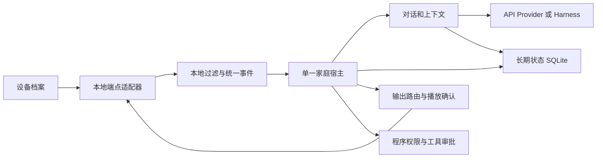

# 西西整体目标架构与逐步验收

最后更新：2026-10-05。性质：目标设计；下文明确区分已实现和待实现。用户已变更计划并暂停持续实施；当前只收口、记录与推送，恢复须有新指示。路线保留作为后续设计参考，遵守每次只完成一个里程碑。

## 用户与成功标准

首要用户是独居老人：自然聊天、可沉默、能打断、记得长期关系，设备重启后人格和关系延续。设备算力较弱，理解/语言/ASR/TTS 主要通过 API；本地负责过滤、身份与会话归属、权限、调度、恢复。健康相关只先做用户同意的生活习惯提醒与观察记录，不做诊断、药物剂量决策或紧急呼叫。传感器与模型必须可更换。

默认一个主人，偶有访客；多主人和多个 AI 角色是未来扩展。不能把热闹当成目标用户一定喜欢的体验。真人感优先于工具数量，体验评价同时看回应内容、停顿、追问、重复、沉默与打断，不用单一分数代替。

## 方案取舍

| 方案 | 优点 | 代价 | 决定 |
|---|---|---|---|
| 全部交给 Harness | 工具/会话实现少 | 长期身份、恢复、主动边界与供应商耦合 | 不作为核心状态所有者 |
| 本地大型多模态模型 | 可离线理解 | 与弱算力/API优先约束冲突 | 不作为默认依赖 |
| 本地轻量宿主＋API大脑＋可替换Harness | 边界/记忆归属稳定，硬件与模型可替换 | 需要明确端点契约、调度与验收 | 采用 |

Harness 负责一轮模型与工具循环，核心持久状态仍属于 domain；DSH 专用 API 只在既有 brain-adapter 边界内。实时对话允许直连 Provider，以相同权限与上下文契约约束；不为使用 Harness 而牺牲延迟。模型新能力先走结构化契约与供应商金丝雀，再接产品入口。

## 模块与数据流

1. **端点层**：配置声明稳定 id、roomId、kind、adapter 与受控参数；adapter registry 负责启动/停止/健康、能力匹配。USB、网络流、浏览器和已有事件来源各自实现适配器，禁止域层读硬件 SDK。设备断线清空实时证据；明确反压、丢帧与音频缓存边界，优先丢过时观察，不能静默丢用户话语或工具结果。
2. **宿主层**：统一房间事件、身份会话、同一话语去重、输出路由、回应窗口、审批和提醒。语音与文本共用 ConversationEngine。仅一个主动判断和一个实际播放队列控制者；不让每个摄像头各调用模型。未知身份不得推断成主人，跨房间使用新鲜位置证据选择输出，证据不足宁可不播私人内容。
3. **状态层**：Raw Event、工作记忆、语义/情景/关系记忆、自我画像与未来事项分层。显式纠正优先；推断带来源/置信度/状态，可查看编辑删除。检索先按 audience 过滤，再做预算。身份升级/访客出现要更换会话并撤销旧输出。迁移 append-only、写入原子、动作结果未知不重试。
4. **大脑层**：理解、选择话题、读空气、回复、受控记忆提取使用可替换 Provider；模型不控制权限/费用/核心人格文件。低优先级任务队列与实时对话分开，资源不足先停后台提取/总结，不能抢占用户轮次。计划只在程序许可工具集内执行，任务结果和未完成意图持久化。
5. **播放层**：文本分段、TTS、端点播放和回采信号分别可替换；完成确认来自端点，生成音频不等于已播放。用户插话取消未播块；自身声音与媒体声音的排除由本地算法给证据，不能靠提示词猜。软件模拟明确标注来源。

## 聊天、缓存与弱算力预算

稳定前缀顺序为身份/硬政策/缓慢变化人格/稳定工具定义；当天场景、检索记忆、当前话语在动态后缀，历史按角色仅出现一次。工具排序和文本序列化确定；时间、随机 id、token 用量、设备状态不进入稳定块。人格修改或工具集变化显式使前缀版本失效，不能缓存到旧策略。缓存命中由真实 usage 与前缀摘要观测，不能以“字符串稳定”宣称供应商缓存已命中。

上下文设可配置预算：短历史＋窗口摘要＋有限相关记忆，摘要保存来源范围、版本和更新时间，纠正/删除记忆后不得沿用旧摘要。长度与预算不靠无限增大 prompt；长对话需跨重启、多轮纠正、工具插入和访客切换回归。模型会话缓存必须按 agent/person/audience 分区。已有 stable prefix、ContextBuilder、cachedTokens 只是基础，端到端预算与实测缓存收益尚未验收。

默认不用 GPU、不依赖 Docker/MQTT 或常驻额外服务；只在必要帧/片段做本地轻量检测，将过滤事件发送大脑。API 并发、请求超时、取消、退避、断网降级和金额预算逐项实现；不把现有主动次数额度写成金额预算。先测峰值 RSS、启动时间、长期库大小、空闲 API 调用、事件积压与响应首字；目标数值须基于选定设备实测后制定，不能编造“低配可用”的固定门槛。

## 老人陪伴与健康辅助

默认使用熟悉、简洁、能等待的交互；支持可配置语速/音量、重复刚才内容、免复杂命令的同意/静默/取消。不把未回应解释为异常、不把记忆推断作为医学事实。健康事项以用户明确提出的喝水、作息、活动等提醒为第一步；将观察、用户自述和推断分别保存，带时间与来源。照护者共享仅在明确授权后设计，默认不外发家庭数据。未来医学功能须独立设计与验证，本阶段不引入。

## 多个 AI 角色

未来通过 agentId 区分人格/私有记忆/上下文缓存，家庭公共事实可授权共享。一个导演调度发言、一个播放队列，轮次设总次数和费用预算，用户发言优先，防止角色相互触发无限循环。角色明确是 AI，不伪装真实家人；默认只开西西，用户随时停止角色间对话。先单角色质量达标，再做此可选里程碑。

## 证据地图与顺序

| 阶段 | 当前证据与缺口 | 交付验收 |
|---|---|---|
| S0 单主人软件闭环 | AmbientRuntime、迁移009、20运行时场景、跨进程demo已实现；本轮开始时744离线测试通过 | 现有基线；硬件和实际断电未验 |
| S1 可配置端点档案 | endpoint-profile与配置化demo已实现；物理驱动registry尚无实现 | 严格v1档案、能力匹配、重复/未知/跨房间拒绝；自定义标识跑同一demo，不访问硬件；收口结果见progress |
| S2 单实际入口装配 | chat直连/fake已接统一宿主，API经HTTP替身验证；DSH及其他入口未接 | 实际fake CLI提醒创建/批准/恢复/打印交付；断网与失败写工具无假完成，供应商/硬件另验 |
| S3 上下文预算与对话质量 | 文本/工具循环JSON预算、usage、有来源记忆变更历史失效、私人同会话有界旧原话已接引擎；120轮及重启demo，无新摘要 | 字节预算不等于token/金额；词面连续性有局限，同语料真人感/真实缓存和DSH服务端失效未验 |
| S4 弱设备长期常驻 | 第一软件步已有两处宿主有界FIFO输入反压；checkpoint账本无压缩、异步外部动作fencing未完成 | 资源预算/实测、保留策略、主动宿主互斥、强制终止恢复实验、金额成本计量与门禁 |
| S5 可插拔真实端点与多房间 | 存在旧voice/perception服务，尚未按新宿主端点协议接入 | 逐种软件回放适配器后物理验证；路由/AEC/多麦归并；设备断线降级 |
| S6 老人体验与生活提醒 | 通用提醒基础已有，老人用户体验未验 | 语速/重复/确认/静默流程；观察与推断分离，明确分享授权；不做诊断或紧急工具 |
| S7 可选多角色 | 设计扩展，无实现 | 不抢用户发言、不串私人记忆、不无限调用，明确AI身份 |

阶段顺序可因证据调整，但每阶段先自动测试与可运行demo；不并行推进多个里程碑。用户完整目标持续有效，S1或任一阶段通过不能宣称整体目标完成。最新事实和测量放 [progress](../progress.md)，当前为 [S4第一步计划](../plans/2026-10-05-input-backpressure.md)，S3真实模型验收仍待手动验证；无需用户每个阶段再次发送继续。
